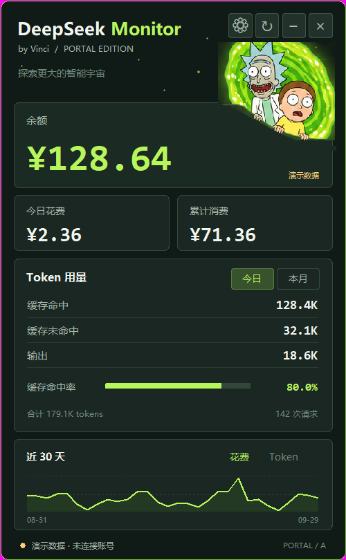

# DeepSeek Monitor · Portal A

**一个轻量的 Windows 桌面悬浮窗，查看 DeepSeek 余额、Token 用量和花费。**

by Vinci · 深色传送门绿主题 · Python / Tkinter




## 下载与运行

在本仓库的 **Releases** 页面下载 `DeepSeekMonitor_PortalA.exe`，双击运行。
适用于 Windows 64 位系统，无需安装 Python，不需要额外的图片或源码文件。

程序不附带任何账号凭据。每位使用者需要连接自己的 DeepSeek 账号。

| 凭据 | 可查看内容 |
| --- | --- |
| DeepSeek API Key | 余额 |
| DeepSeek 开放平台登录态 | 余额、用量、花费和趋势 |

首次使用可在设置中填写 API Key，或先在 Chrome / Edge 登录 DeepSeek 开放平台，再尝试「自动提取」。
API Key 无法解锁完整用量，这是两类接口权限不同导致的。

## 功能

- 余额、低余额提醒、今日和本月花费、累计消费。
- 缓存命中、缓存未命中、输出 Token、缓存命中率与请求数。
- 近 30 天花费 / Token 趋势及单日悬停提示。
- 折叠余额条、拖动定位、窗口置顶、定时刷新。
- 网络失败时保留上次成功数据并提示失败；缺失数据显示「—」。

| 操作 | 功能 |
| --- | --- |
| 拖动顶部空白区域 | 移动窗口 |
| `−` / `⌃` 或 Ctrl+Space | 收起 / 展开 |
| `↻` 或 F5 | 立即刷新 |
| `⚙` 或 Ctrl+, | 账号设置 |
| 今日 / 本月 | 切换统计范围 |
| 花费 / Token | 切换趋势指标 |
| 点击底部状态 | 查看同步详情 |
| 右键 | 刷新间隔、置顶、重新读取登录态和退出 |
| `×` 或 Esc | 退出 |

## 数据与配置

余额来自 DeepSeek 官方接口，完整用量使用开放平台面板接口。
平台面板接口可能随 DeepSeek 改版而变化，数据显示也可能存在延迟。
本项目是独立桌面工具，与 DeepSeek 官方没有隶属关系。

设置位于 `%USERPROFILE%\.deepseek-monitor\config.json`，包括凭据、位置、刷新间隔和折叠状态。
凭据保存在本机配置文件中；配置文件和运行日志不属于发布源码，不应提交至仓库或随程序分享。
人物和传送门装饰取自主题概念图，界面卡片和数据为原生 Tk Canvas 绘制。

## 离线预览

```powershell
.\DeepSeekMonitor_PortalA.exe --demo
```

演示模式不读取账号、不联网、不写用户配置。上方截图使用示例数据。

## 从源码运行

构建环境：Windows、Python 3.14。

```powershell
py -3.14 -m venv .venv
.\.venv\Scripts\python.exe -m pip install -r requirements.txt
.\.venv\Scripts\python.exe run_portal.py
```

## 测试和打包

```powershell
.\.venv\Scripts\python.exe test_routing.py
.\.venv\Scripts\python.exe test_portal.py
.\.venv\Scripts\python.exe build_portal.py
```

产物：`dist/DeepSeekMonitor_PortalA.exe`。

数据选路测试使用假响应；界面测试使用离线数据和独立配置，不读取用户账号。
界面测试覆盖展开 / 折叠、月度切换、图表、低余额、仅余额模式、错误状态、多档缩放和凭据遮罩。

## 项目结构

```text
dsmon/portal.py      Portal A 主题界面
dsmon/api.py         余额和用量查询
dsmon/config.py      本地配置
dsmon/platform_auth.py  平台登录态读取
dsmon/ui.py          保留的原版界面
assets/             主题素材
docs/images/        演示截图
run_portal.py       新版入口
build_portal.py     Windows 单文件打包
```

源码和必要素材存放在仓库中，编译后的 exe 通过 Releases 分发。
